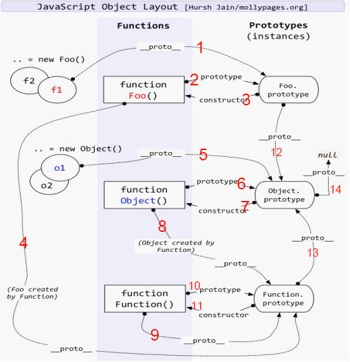

> JavaScript是一门基于原型继承的语言
> 
> ——Douglas Crockford


## 函数的prototype属性



JS中的**函数**有一个属性`prototype`，指向其**原型对象**，其它类型的变量不存在该属性。

```javascript
var a = 1, str = "中国", flag = true, obj = {}, func = function() {};
function add() {}
var test = new Function;

console.log(a.prototype);//undefined
console.log(str.prototype);//undefined
console.log(flag.prototype);//undefined
console.log(obj.prototype);//undefined
console.log(func.prototype);//Object{}
console.log(add.prototype);//Object{}
console.log(test.prototype);//Object{}
```

## 对象的__proto__属性

任何对象（除了`undefined`和`null`）都拥有一个属性，指向其**原型对象**，在大多数浏览器中，这个属性的名字是`__proto__`


```javascript
var a = 1, str = "中国", flag = true, obj = {}, func = function() {};
function add() {}
var test = new Function;

console.log(a.__proto__ === Number.prototype);
console.log(str.__proto__ === String.prototype);
console.log(flag.__proto__ === Boolean.prototype);
console.log(obj.__proto__ === Object.prototype);
console.log(func.__proto__ === Function.prototype);
console.log(add.__proto__ === Function.prototype);
console.log(test.__proto__ === Function.prototype);
console.log(NaN.__proto__ === Number.prototype);
console.log(undefined.__proto__);//Uncaught TypeError: Cannot read property '__proto__' of undefined
console.log(null.__proto__);//Uncaught TypeError: Cannot read property '__proto__' of null
```

也就是说：

> 对象实例的`__proto__`值 和 **其构造函数**的`prototype`值 指向了同一块内存区域，这两个属性完全相等

## 原型链

JS是基于原型继承的面向对象语言，这是它和C++、Java等其他面向对象语言的根本区别。网上流传的这张图很好地画出了JS家族的“族谱”。下面我结合这张图，谈谈我对图中每一根“链条”的理解~

**注意：为了便于理解，建议把“函数”和“函数的原型”想象成内存中独立的两个块，函数的`prototype`指针，指向了“函数的原型”这个对象**

1. `f1`对象是构造函数`Foo`的“实例”，因此`f1.__proto__ === Foo.prototype`
2. 函数`Foo`的`prototype`属性指向了“函数的原型”，即`Foo.prototype`
3. 函数的原型有一个`constructor`属性，指向函数本身，也就是说`Foo.prototype.constructor === Foo`。**另外`f1`对象也有一个`constructor`属性，表示对象的构造函数，因此`f1.constructor === Foo`**
4. `function Foo()`的另一种声明方式是`var Foo = new Function()`，所以`Foo.__proto__ === Function.prototype`
5. `var o1 = new Object()`，因此`o1.__proto__ === Object.prototype`
6. 同**2.**
7. 同**3.**
8. `Object`是JS内置的用于生成“对象类型的对象”的构造函数，因此`function Object()`可以理解为`var Object = new Function()`，也就是说`Object`是`Function`构造出来的实例对象，所以`Object.__proto__ === Function.prototype`
9. 这里有点难以理解，`Function`是JS内置的用于生成“函数类型的对象”的构造函数，**8.**中的`Object`函数就是通过它`new`出来的。而我们知道，在JS的语法中，`function AAA()`可以改写为`var AAA = new Function()`，那么，`function Function()`可以改写成`var Function = new Function()`吗？答案是：可以！也就是说：如果把`Function`理解为一个对象，它的`__proto__`属性等于`Function.prototype`；如果把`Function`理解为一个函数，它的`prototype`属性当然也指向`Function.prototype`。所以，`Function.__proto__ === Function.prototype`！
10. 同**2.**
11. 同**3.**
12. 除了（构造）函数`Object`以外，JS中任何（构造）函数的原型都有一个`__proto__`属性指向`Object.prototype`这个原型。而（构造）函数`Object`的原型直接指向`Object.prototype`，中间不需要通过`__proto__`属性相连。因此`Foo.prototype.__proto__ === Object.prototype`、`Function.prototype.__proto === Object.protype`、`Object.prototype === Object.prototype`(废话！)
13. 同**12.**
14. `Object.prototype`可以被认为是JS世界中一切的老祖宗，因为一切对象都继承自她，一切对象往上追溯若干个`__proto__`都会到达`Object.prototype`这里。那么问题是，`Object.prototype`也是一个对象，她的`__proto__`属性应该是她的“构造函数的原型”，那么这个原型是什么呢？我们试一下：

  > Object.prototype.\_\_proto\_\_ === null

**WTF?!(黑人问号脸)**老祖宗是特么从石头缝里蹦出来的？！不过这到让JS蒙上了一层神（装）秘（逼）色彩。

> 我们翻过了一座又一座山头，到头来发现山的那边还是一座山。
>
> 我们以为故事的结尾有一只精灵藏匿在这语言的最核心，最后发现，这语言的核心竟是一场空。

**--END--**